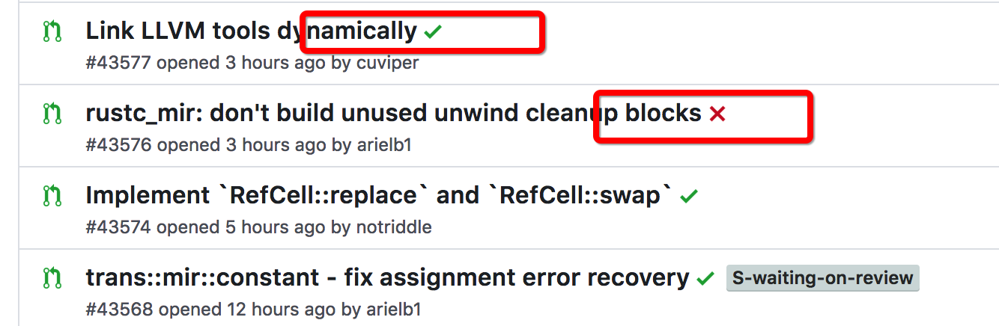

# 安全开车"一带一路" 之请系好安全带

<span style="" >之单元测试--软件开发的安全带<span>

---
## 这是什么鬼?

单元测试即对程序的最小单元进行正确性验证的测试工作

---

## 我要ta有何用?
- 使软件bug更少更健壮
- 减少调试时间
- 优化代码结构
- 适应变化
- 表达设计者思路
- 持续集成的基础

---
### 理想状态
[典型的持续集成案例](https://github.com/rust-lang/rust/commits/master)
<br>


---
## 我们该如何做

---

###举个最小的栗子

写一个计算平方数的函数<br>
+++

为了运行效率，我们采用宏来实现

+++

```c
#define square(a) a*a
```
---

测试代码
```c

// 测试正常int
void test_square_with_normal_int() {
    assert(square(0) == 0);
    assert(square(1) == 1);
    assert(square(100) == 10000);
    assert(square(-100) == 10000);
}

// 测试正常float
void test_square_with_normal_float() {
    float a = 0.1;
    assert(square(a) == 0.01); // ?
    //...
}

// 测试作为表达式
void test_square_as_expression() {
    
    assert(2*square(3) == 18);
    assert(square(3)*2 == 18);
    assert((int)square(1.5) == 2);
}

// 测试传入表达式
void test_square_with_expression() {
    assert(square(3+2) == 25);
    assert(square(3*2) == 36);
}

// 测试传入有副作用的表达式
void test_square_with_side_effect_expression() {
    int a = 2;
    assert(square(a++) == 4);
}

int main() {
    test_square_with_normal_int();
    test_square_with_normal_float();
    test_square_as_expression();
    test_square_with_expression();
    test_square_with_side_effect_expression();
}
```

---

有依赖的单元

---
## 更典型(复杂)一点的例子
我们现在来做一个叫做“餐厅”的App
顾客点菜 -> 服务员下单 -> 厨师

---
## 困难

---
## 下期分享
### 崎岖山路 vs 都市大道
