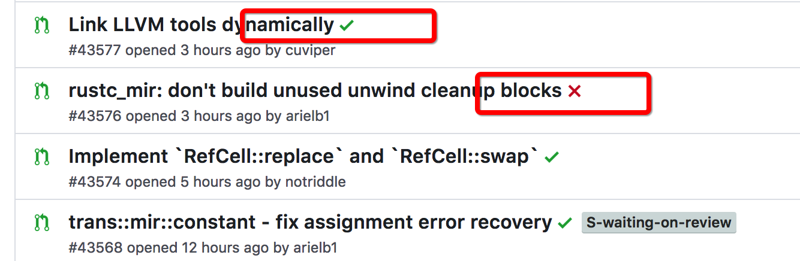
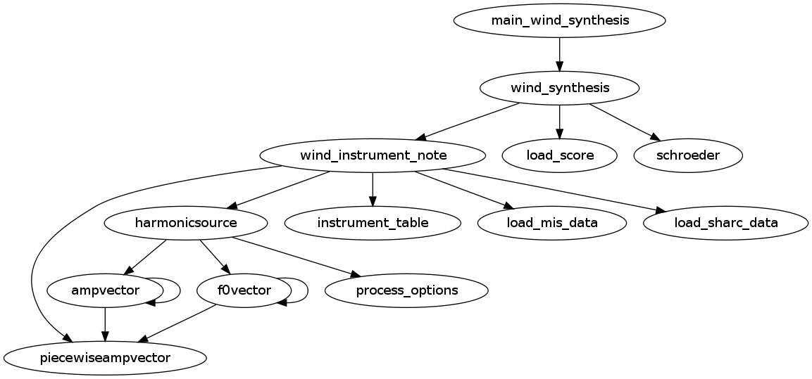
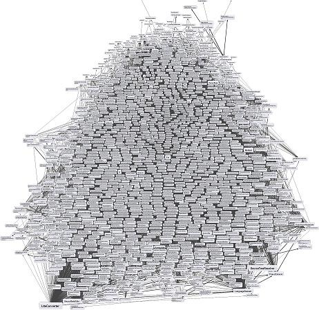
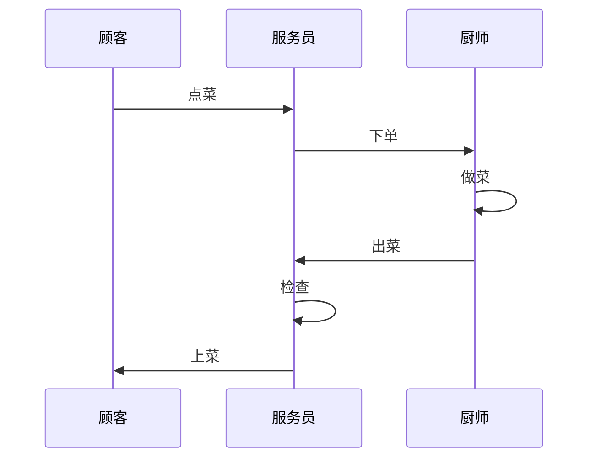
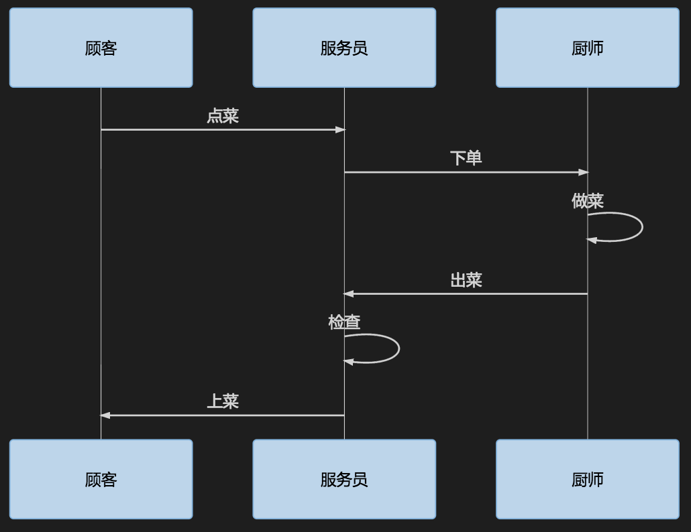

# 安全开发"一带一路" 
## 之请系好安全带
+++

##--单元测试初探(C语言版)
---

## 什么是单元测试?
- 单元测试即对程序的最小单元进行正确性验证的测试工作 <!-- .element: class="fragment" -->
- 此工作通常有开发人员自己完成 <!-- .element: class="fragment" -->
---

## 单元测试有何用?
- 使软件bug更少更健壮 <!-- .element: class="fragment" -->
- 减少调试时间 <!-- .element: class="fragment" -->
- 优化代码结构 <!-- .element: class="fragment" -->
- 适应变化 <!-- .element: class="fragment" -->
- 表达设计者思路 <!-- .element: class="fragment" -->
- 持续集成的基础 <!-- .element: class="fragment" -->

---
### 理想状态



[典型的持续集成案例](https://travis-ci.org/rust-lang/rust/builds/264040464)

---
## 我们该如何做

---

###举个最小的栗子

写一个计算平方数的函数<br>
+++

为了运行效率，我们采用宏来实现

+++

```c
#define square(a) a*a
```
---

如何测试？

+++
```c
// 测试正常int
void test_square_with_normal_int() {
    assert(square(0) == 0);
    assert(square(1) == 1);
    assert(square(100) == 10000);
    assert(square(-100) == 10000);
}
```

+++

```c
// 测试正常float
void test_square_with_normal_float() {
    float a = 0.1;
    assert(square(a) == 0.01); // ?
    //...
}
```
+++
```c
// 测试作为表达式
void test_square_as_expression() {
    
    assert(2*square(3) == 18);
    assert(square(3)*2 == 18);
    assert((int)square(1.5) == 2);
}
```
+++

```c
// 测试传入表达式
void test_square_with_expression() {
    assert(square(3+2) == 25);
    assert(square(3*2) == 36);
}
```
+++

```c
// 测试传入有副作用的表达式
void test_square_with_side_effect_expression() {
    int a = 2;
    assert(square(a++) == 4);
}
```

+++
```c
int main() {
    test_square_with_normal_int();
    test_square_with_normal_float();
    test_square_as_expression();
    test_square_with_expression();
    test_square_with_side_effect_expression();
}
```
---

### So easy!

---

### Not so easy!

+++

单元之间有依赖

```
    A --> B
```

+++

我们实际软件是这样的

+++
<!-- .slide: data-background-transition="none" -->

+++

或者是这样的

<!-- .slide: data-background-transition="none" -->


---
### 更典型一点的例子

我们现在来做一个叫做“餐厅”的应用<br>
业务流程如下:



+++



业务流(依赖关系)

---
### 如何测试服务员?

---
## 指标：代码覆盖率
- GCOV

---
# 完

祝大家编码愉快

---
## 下期分享
### 崎岖山路 vs 都市大道

The Rust Programing Language